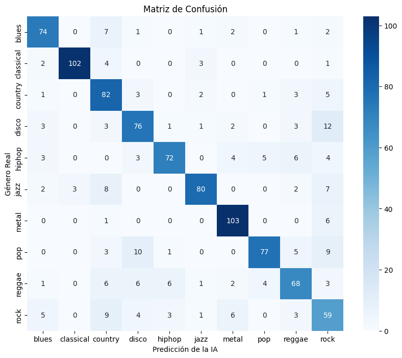
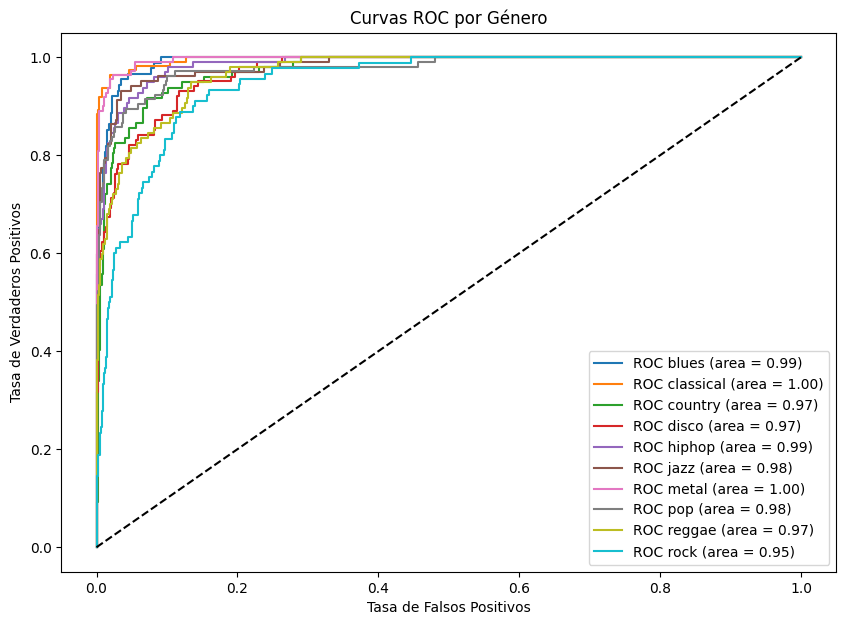

# 🎵 Music Genre Classification: Deep Learning con CNN

Este repositorio contiene un sistema de clasificación automática de géneros musicales basado en **Redes Neuronales Convolucionales (CNN)**. El proyecto abarca desde el preprocesamiento de señales de audio hasta el despliegue del modelo en Hugging Face.

## 🚀 Evolución y Arquitectura
El modelo fue evolucionando para mejorar su capacidad de generalización. La arquitectura final incluye:
* **Capas Convolucionales**: 4 capas con filtros de 32, 64, 64 y 128 para extraer características tímbricas complejas.
* **Regularización**: Uso de **Dropout (0.5)** y **Batch Normalization** para reducir el sobreajuste.
* **Optimización**: Adam optimizer con una tasa de aprendizaje de 0.0001.

## 📊 Resultados y Métricas
El modelo alcanzó un **accuracy del 80%** en el conjunto de validación.

### Reporte de Clasificación (Resumen):
| Género | F1-Score | Notas |
|--------|----------|-------|
| **Classical** | **0.94** | Género con mayor precisión debido a su firma sonora única. |
| **Metal** | **0.90** | Excelente detección de texturas de distorsión. |
| **Rock** | **0.60** | El mayor reto, frecuentemente confundido con Country. |

### Análisis Visual
* **Matriz de Confusión**: Revela que el modelo es experto en géneros con instrumentación definida pero presenta ambigüedades en géneros híbridos.
* **Curvas ROC**: Todas las clases presentan un AUC > 0.93, demostrando una alta capacidad de discriminación.

## 🎧 Pruebas en el Mundo Real (Inferencia)
El modelo fue validado con pistas externas al dataset GTZAN:
1.  **Mozart - Lacrimosa**: Clasificado correctamente como **Classical** con un **80.34% de confianza**.

## 🛠️ Tecnologías
* **Lenguaje**: Python
* **Librerías**: TensorFlow/Keras, Librosa (Audio), Scikit-learn, Matplotlib.
* **Dataset**: GTZAN (1,000 samples de 30s).

## 📂 Enlaces del Proyecto
* **Modelo en Hugging Face**: [alejandrotg-code/music-genre-classification](https://huggingface.co/alejandrotg-code/music-genre-classification)
* **Dataset**: GTZAN Genre Collection.

---
Desarrollado por [Alejandro Tacoronte](https://www.linkedin.com/in/alejandrotacoronte/) - 2026
